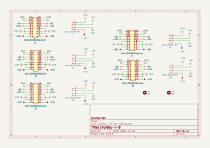
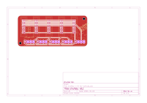

# chufebu

Bus de alimentación eurorack: 5 headers de 16 pines (2x08) con ±12V y +5V, cada uno con su conector Molex KK-396 de 4 pines.

## Revisiones

- `v0.1 rev-a`: fabricada en octubre 2026, todavía sin probar.

## Manual de uso

### Qué necesitas

- Una fuente de alimentación Eurorack con ±12V (y +5V si algún módulo lo usa).
- Cables planos Eurorack de 16 pines (16-16) o de 10 a 16 pines (10-16), uno por módulo.
- Opcional: 2 tornillos M3 y separadores para montar la placa.

### Conexión

1. Con la fuente **apagada**, conecta la fuente a uno de los headers de 16 pines o a uno de los conectores Molex.
2. Conecta cada módulo con un cable plano a cualquiera de los headers de 16 pines.
3. Orienta cada cable con la **franja roja hacia -12V**. El serigrafiado de la placa marca `-12` en un extremo del header.
4. Revisa todas las conexiones antes de encender la fuente.

### Pines

Header de 16 pines (según el estándar Eurorack de Doepfer):

| Pines | Señal |
| --- | --- |
| 1, 2 | -12V |
| 3 a 8 | GND |
| 9, 10 | +12V |
| 11, 12 | +5V |
| 13, 14 | CV |
| 15, 16 | GATE |

Conector Molex KK-396 de 4 pines:

| Pin | Señal |
| --- | --- |
| 1 | -12V |
| 2 | GND |
| 3 | +5V |
| 4 | +12V |

### Advertencias

- Un cable plano conectado al revés puede dañar el módulo o la fuente. Los headers tienen carcasa con muesca de polarización, pero revisa siempre la franja roja, sobre todo en el lado del módulo.
- Conecta y desconecta cables solamente con la fuente apagada.
- chufebu no tiene fusibles ni protección contra polaridad inversa: la protección depende de la fuente y de cada módulo.
- La corriente total disponible la limita la fuente. Suma el consumo de tus módulos en cada línea y no superes lo que entrega la fuente.

## Esquemático y placa (v0.1 rev-a)

Generados automáticamente por GitHub Actions a partir de `hardware/chufebu-v-0-rev-a/chufebu-v-0-rev-a.kicad_sch` y `.kicad_pcb` en cada push que los modifica.

Render 3D de la placa:

<video src="./videos/chufebu-placa-3d-giro.mp4" autoplay loop muted playsinline width="540">Render 3D de la placa de chufebu v0.1 rev-a.</video>

## Bill of materials (v0.1 rev-a)

Generado a partir de `hardware/chufebu-v-0-rev-a/chufebu-v-0-rev-a.kicad_sch`.

<!-- BOM_TABLE_START -->

| Referencias | Cantidad | Valor | Huella | Descripción |
| --- | --- | --- | --- | --- |
| J1, J2, J3, J7, J8 | 5 | Conn_02x08_Odd_Even | Connector_IDC:IDC-Header_2x08_P2.54mm_Vertical | Header de alimentación Eurorack (16 pines): box header 2x08, 2.54 mm, vertical, THT, con carcasa y muesca de polarización ([Thonk](https://www.thonk.co.uk/shop/16pin-power-headers-shrouded/)) |
| J4, J5, J6, J9, J10 | 5 | Conn_01x04_Pin | Connector_Molex:Molex_KK-396_5273-04A_1x04_P3.96mm_Vertical | Conector de alimentación (4 pines): Molex KK-396 5273-04A, 1x04, 3.96 mm, vertical, THT |

10 componentes en total.

<!-- BOM_TABLE_END -->

### Placa (PCB)

Fabricar con los gerbers y archivos de taladrado de [`hardware/chufebu-v-0-rev-a-fab`](https://github.com/piruetasxyz/chufebu/tree/main/hardware/chufebu-v-0-rev-a-fab).

| Especificación | Valor |
| --- | --- |
| Capas | 2 |
| Tamaño | 100 × 45 mm |
| Grosor | 1.6 mm |
| Cobre | 35 µm (1 oz) |
| Acabado superficial | HASL sin plomo (LeadFree HASL) |

## Créditos

- Aarón Montoya-Moraga: investigación, esquemático, PCB, fabricación y documentación.
- Matías Serrano: revisor experto de esquemáticos y PCBs.

## Licencia

El hardware está bajo CERN-OHL-P-2.0 y esta documentación bajo CC-BY-SA-4.0. Ver [LICENSE.md](https://github.com/piruetasxyz/chufebu/blob/main/LICENSE.md).
